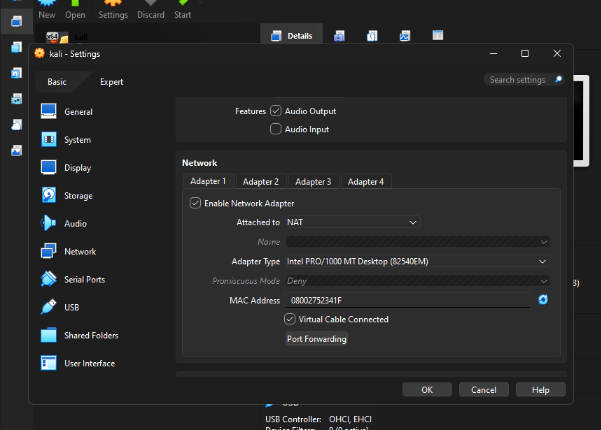
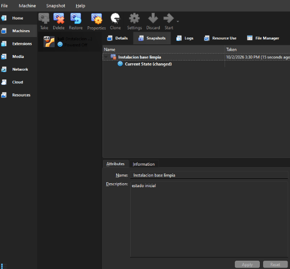
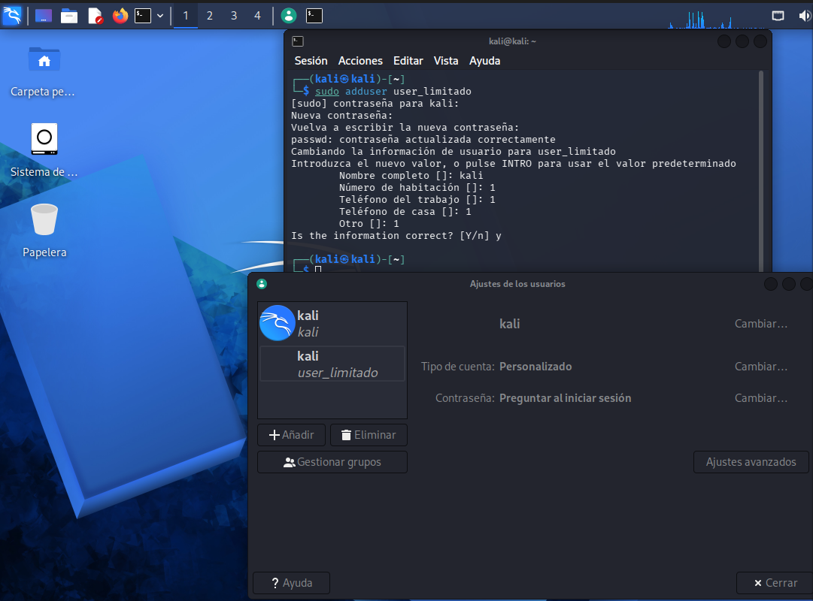

# laboratorio-virtualbox-ciberseguridad

# Laboratorio de Ciberseguridad: Entorno Virtualizado con VirtualBox

Este repositorio contiene la documentación y evidencias de la configuración de un laboratorio de pruebas seguro utilizando **Oracle VM VirtualBox** y **Kali Linux** como sistema invitado (*Guest*).

---

## 1. Configuración del Aislamiento de Red

### Justificación Técnica
Se eligió el modo NAT para permitir que la VM tenga salida a Internet de forma segura. 
A diferencia del modo Puente que expone la máquina virtual directamente en la red WiFi del hogar junto a otros dispositivos, NAT actúa como un firewall unidireccional: la VM puede realizar conexiones salientes hacia Internet, pero ningún dispositivo externo o de la red local puede iniciar conexiones hacia ella, manteniendo el laboratorio aislado.

---

## 2. Protección del Estado Inicial (Snapshots)

### Punto de Restauración
Se creó la instantánea con el nombre **"Instalación Base Limpia"** tras finalizar la instalación y configuración inicial del sistema operativo. Esto garantiza contar con un punto de restauración seguro al cual regresar en segundos si el sistema se destruye, desconfigura o infecta durante la ejecución de pruebas de seguridad.

### Creacion de usuario limitado

---
